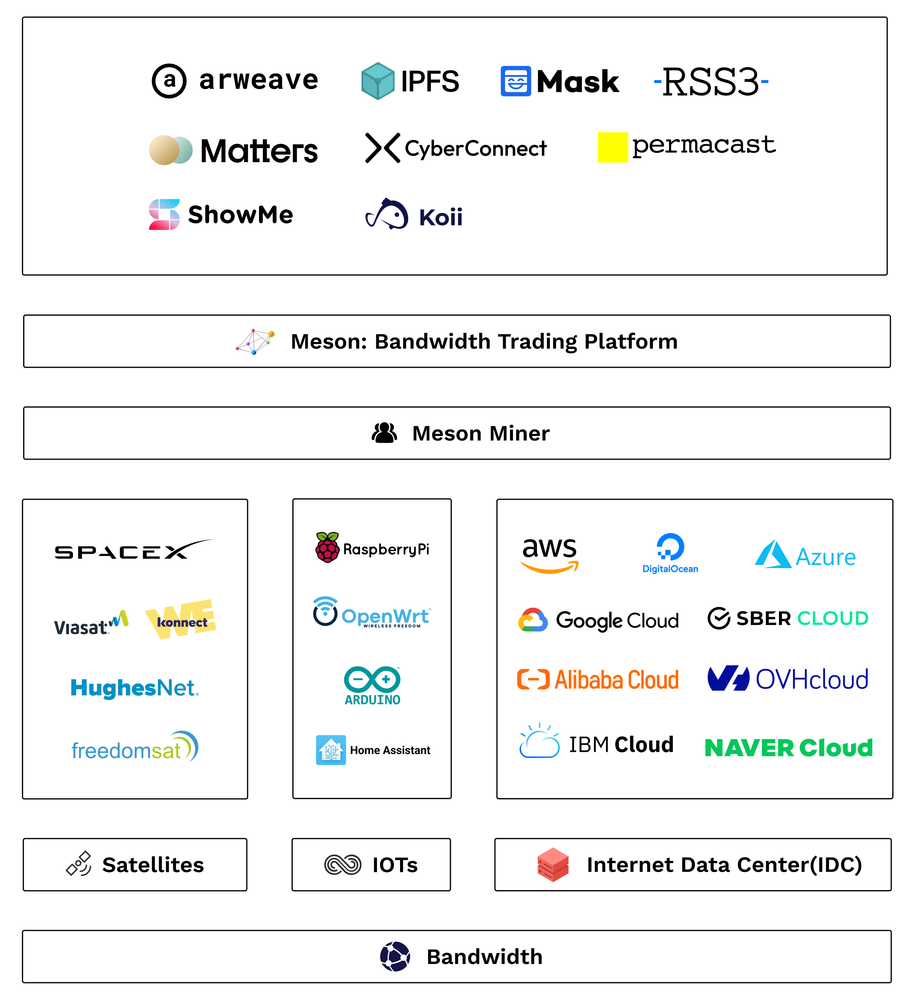
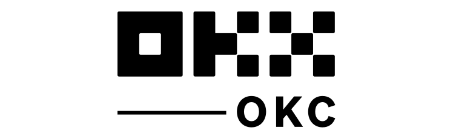
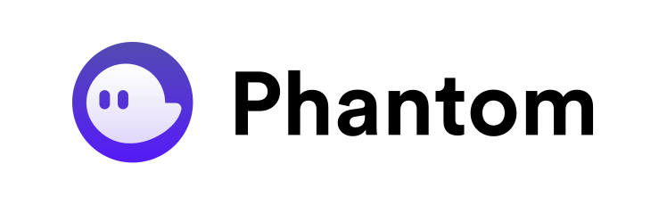
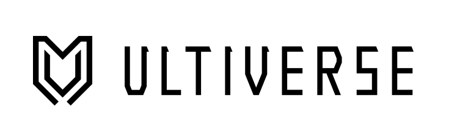
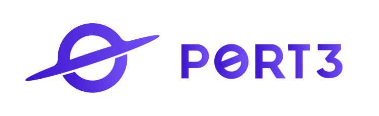
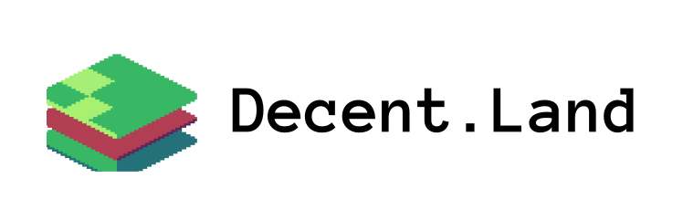
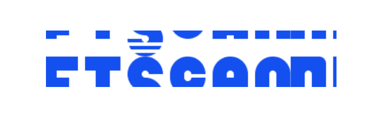

# Introduction

## What Meson Network Is

Meson Network is committed to creating an efficient bandwidth marketplace on Web3, using a blockchain protocol model to replace the traditional labor-based sales models, consolidating and monetizing idle bandwidth from long-tail users at a low cost. Meson Network is the foundation of data transmission for decentralized storage, computation, and the emerging Web3 Dapp ecosystem.

Meson is trying to create the world’s largest bandwidth marketplace in the future. Here, users can exchange their unused bandwidth resources with Meson for tokens, and those who need bandwidth will come to Meson’s market to borrow bandwidth anywhere in the world. To achieve this goal, we cannot simply use the direct sales model.

Existing cloud vendors rely more on a sales model, a top-down model, for aggregation of resources. For example, if you want to open a new local market, you need to recruit local people, and as the market coverage expands, the number of people recruited rises linearly or even exponentially. This model worked very well for the last 10–20 years because the sales model led to people targeting medium to large accounts, which can provide high output per account. But now, the situation is that a lot of resources are slowly dispersing to the long-tail market where the demand is much more fragmented, leading to much lesser output per account. However, demand from the long-tail market is growing stronger than the large account market. To capture the long tail market demand, there needs to be a new alternative to the direct sales model. The answer is open bandwidth exchange, done through Meson Network.

Meson can integrate resources from the bottom up. Users do not need to care about how to deal with people, they only need to upload or access the resources in the marketplace according to standards and protocols. The advantage of this new model is to remove human interaction in the system as much as possible, and to quickly achieve scale through free market mechanisms. Using the human sales model, if we are very lucky, we might create another Amazon. However, using the protocol model, we don’t need to define the composition of roles at both ends of the market. Maybe a boring user connects his Starlink network to Meson; maybe a large number of developers connect different Telecoms around the world to Meson; maybe in the future, Meson’s market will cover the resources of cloud vendors such as Amazon and Google, but we are just a team of less than 100 people at that point.

Extended Reading:

- [Meson Network 2022](https://medium.com/meson-network/meson-network-2022-ec246bae8fcc)
- [Explore Data Center Carbon Protocol](https://medium.com/meson-network/explore-data-center-carbon-protocol-d1833ef03a68)
- [Decentralized Infrastructure in Web3](https://medium.com/meson-network/web3-decentralized-infrastructure-b919cd1d5c48)

## How Meson Network Works

Extended Version: [How Meson Network Works (Official Video)](https://www.youtube.com/watch?v=3Dgwse5mWuA)
 

## Social Media

We have an active and growing community. All are welcome to be part of our community, help shape it, or simply observe.

At any point, feel free to join our [Discord server](https://discord.gg/invite/z6YfSHDkmS) and [Telegram group](https://t.me/mesonnetwork).

Join in the [🦄 Meson BUILDer Program](https://forms.gle/xEavrpdo8j4Mwh2XA).

We also use [GitHub](https://github.com/daqnext) Issues and Discussions.

Or you can follow [Twitter](https://twitter.com/NetworkMeson) and [Medium](https://medium.com/meson-network) for updates.

   

## Ecosystem

### Meson Partners

Feel free to submit yours in Let us know!

    
        
            
        
        
            <h4>Arweave</h4>
            
Meson Network supports store data, permanently.

        
        
            <a target="_blank" href="https://www.arweave.org/?utm_source=mesonnetwork">Open Arweave</a>
        
    
    
        
            
        
        
            <h4>Mask</h4>
            
Meson Network supports bridge from Web2.0 to Web3.0.

        
        
            <a target="_blank" href="https://mask.io/?utm_source=mesonnetwork">Open Mask</a>
        
    
    
        
            
        
        
            <h4>Matters</h4>
            
Meson Network supports the next decentralized content ecosystem.

        
        
            <a target="_blank" href="https://matters.news/?utm_source=mesonnetwork">Open Matters</a>
        
    
    
        
            
        
        
            <h4>RSS3</h4>
            
Meson Network supports the open information syndication protocol in Web3.

        
        
            <a target="_blank" href="https://rss3.io/?utm_source=mesonnetwork">Open RSS3</a>
        
    
    
        
            
        
        
            <h4>OKX Chain</h4>
            
Bringing dCDN to the Forefront of Web3.

        
        
            <a target="_blank" href="https://www.okx.com/okc/?utm_source=mesonnetwork">Open OKX Chain</a>
        
    
    
        
            
        
        
            <h4>Cyberconnect</h4>
            
Meson Network supports the social graph in Web3.

        
        
            <a target="_blank" href="https://cyberconnect.me/?utm_source=mesonnetwork">Open Cyberconnect</a>
        
    
    
        
            
        
        
            <h4>Phantom</h4>
            
A friendly Solana wallet built for DeFi & NFTs.

        
        
            <a target="_blank" href="https://phantom.app/?utm_source=mesonnetwork">Open Phantom</a>
        
    
    
        
            
        
        
            <h4>Koii Network</h4>
            
Meson Network supports decentralized publishing protocol and Web3 library.

        
        
            <a target="_blank" href="https://koii.network/?utm_source=mesonnetwork">Open Koii Network</a>
        
    
    
        
            
        
        
            <h4>Crust Network</h4>
            
Meson Network supports Web3 industry a turn key solution.

        
        
            <a target="_blank" href="https://crust.network/?utm_source=mesonnetwork">Open Crust Network</a>
        
    
    
        
            
        
        
            <h4>ShowMe</h4>
            
Meson Network supports NFT social subscription platform in Web3.

        
        
            <a target="_blank" href="https://showme.fan/?utm_source=mesonnetwork">Open ShowMe</a>
        
    
    
        
            
        
        
            <h4>Permacast</h4>
            
Meson Network supports Web3 Podcast hosting platform.

        
        
            <a target="_blank" href="https://permacast.dev/?utm_source=mesonnetwork">Open Permacast</a>
        
    
    
        
            
        
        
            <h4>Ultiverse</h4>
            
Meson Network supports the social gaming metaverse in Web3.

        
        
            <a target="_blank" href="https://www.ultiverse.io/?utm_source=mesonnetwork">Open Ultiverse</a>
        
    
    
        
            
        
        
            <h4>Port3</h4>
            
Meson Network supports the Gateway to Web3 Social Graph.

        
        
            <a target="_blank" href="https://www.port3.io/?utm_source=mesonnetwork">Open Port3</a>
        
    
    
        
            
        
        
            <h4>Decent.Land</h4>
            
Meson Network supports the Social infrastructure for Web3.

        
        
            <a target="_blank" href="https://www.decent.land/?utm_source=mesonnetwork">Open Decent.Land</a>
        
    
    
        
            
        
        
            <h4>NFTSCAN</h4>
            
Provide users with a simple and efficient NFT retrieval service.

        
        
            <a target="_blank" href="https://www.nftscan.com/?utm_source=mesonnetwork">Open NFTSCAN</a>
        
    

