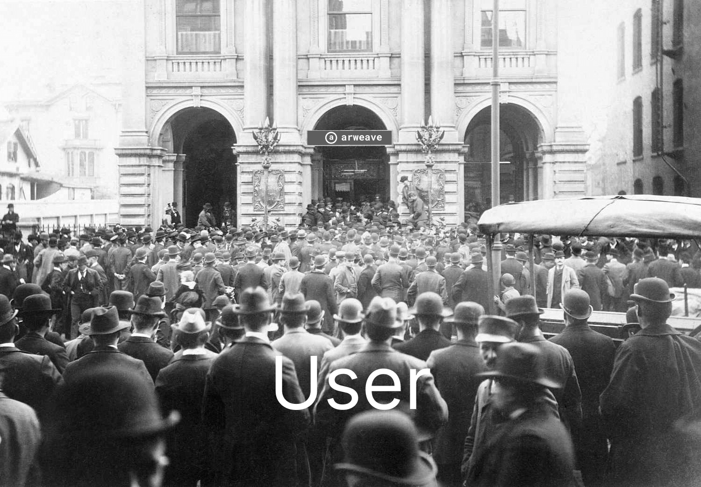
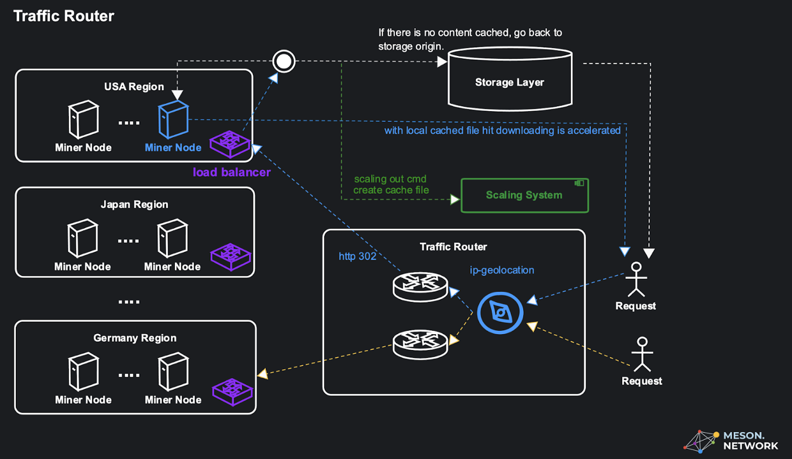
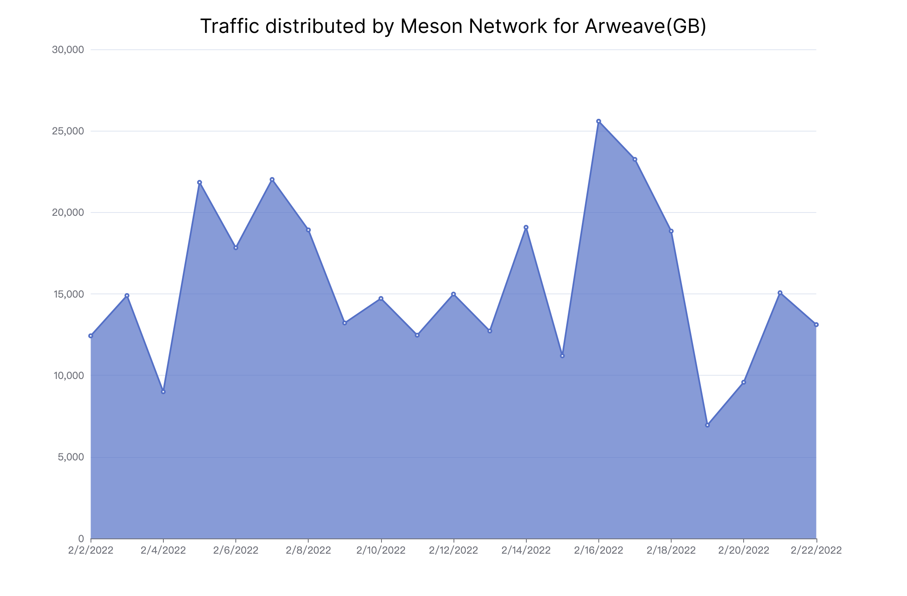
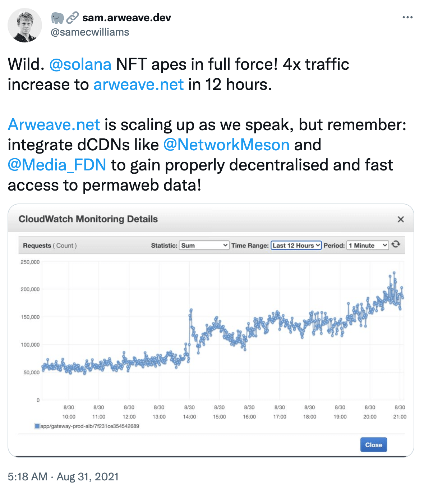

# Case Study: Arweave Gateway

>Use Meson Network to help Arweave Gateway alleviate the Retrieval bottleneck under high concurrent requests.

## Challenge

❓ **Arweave has a lot of pressure from NFT retrieval**

This is because NFT files are usually very small image files. Every time a user accesses an NFT, they need to make a request to the Gateway. The Gateway retrieves the NFT and returns it to the user.



❓ **Gateway encountered a physical bottleneck**

When the NFT Marketplace access surges at a certain point in time, these high concurrent requests may cause the server to run out of resources, causing the Gateway node to reach the ***CPU, I/O, Memory and Bandwidth Bound*** in the physical environment (you can learn from Brendan Gregg's [Systems Performance](https://www.goodreads.com/en/book/show/18058001-systems-performance) Learn more in the book).

❓ **Files need to be cached closer to the user to shorten the request speed of the user from the original site**

Using an origin server without a CDN means that each Internet request must return to the physical location of that Gateway server, regardless of where in the world it resides.

## Solution

✅ **Meson dCDN store (cache) Arweave in strategic locations in order to take the load off of Arweave Gateway**

By moving static assets like images, videos and audios (and potentially other content) as close as possible to the requesting meson node, an meson node cache is able to reduce the amount of time it takes for a Arweave resource to load.

✅ **Ability to easily retrieve Arweave content**

Customers can easily access content on the Arweave network without having to deploy and secure their own Arweave nodes. Meson’s gateway leverages Arweave nodes on its own resilient and security-hardened network to retrieve Arweave content. Meson Arweave gateway can be viewed as a cache in front of Arweave. The Meson Arweave Gateway cannot be used to modify or remove content from the Arweave network.

✅ **Ability to serve Arweave content through subdomain names**

A Gateway needs an SSL certificate in order to keep user data secure, prevent attackers from creating a fake version of the Gateway, and gain user trust.

✅ **Leverage dCDN for Arweave content (caching, performance, reliability)**

When using the Meson Arweave gateway, customers get the additional benefit of using the Meson CDN, which can cache Arweave content close to users, increasing overall performance.



## Example

Change the Arweave Gateway into the Meson Gateway. [Read More](https://docs.meson.network/using/meson-enhances-arweave.html)

```bash
https://arweave.net/-ZW0S2kqxYSRUHQW5AbBp046gLILFCZmxf37HoP1K4k
=>
https://{your_pull_zone}.meson.network/-ZW0S2kqxYSRUHQW5AbBp046gLILFCZmxf37HoP1K4k
```


[Meson enhance Arweave Demo](https://mesondemo.github.io/meson-arweave.html)

## Results




The Meson Gateway for Arweave has withstood high concurrent Retrieval requests from Arweave, and has been running stably for **500** days with **100%** online rate, which support **4072.77 TB** Arweave files to be retrieved. (As of August 5, 2022).

[](https://twitter.com/samecwilliams/status/1432452769785462797)

## Extended Reading

- [Meson enhance Arweave](https://docs.meson.network/using/meson-enhances-arweave.html)
- [Meson Mechanism](https://medium.com/meson-network/meson-enhance-arweave-86c8cabba8f2)
- [Sam Williams. 15 Aug 2021. Tweet.](https://twitter.com/samecwilliams/status/1426827828096610310)
- [Sam Williams. 31 Aug 2021. Tweet.](https://twitter.com/samecwilliams/status/1432452769785462797)