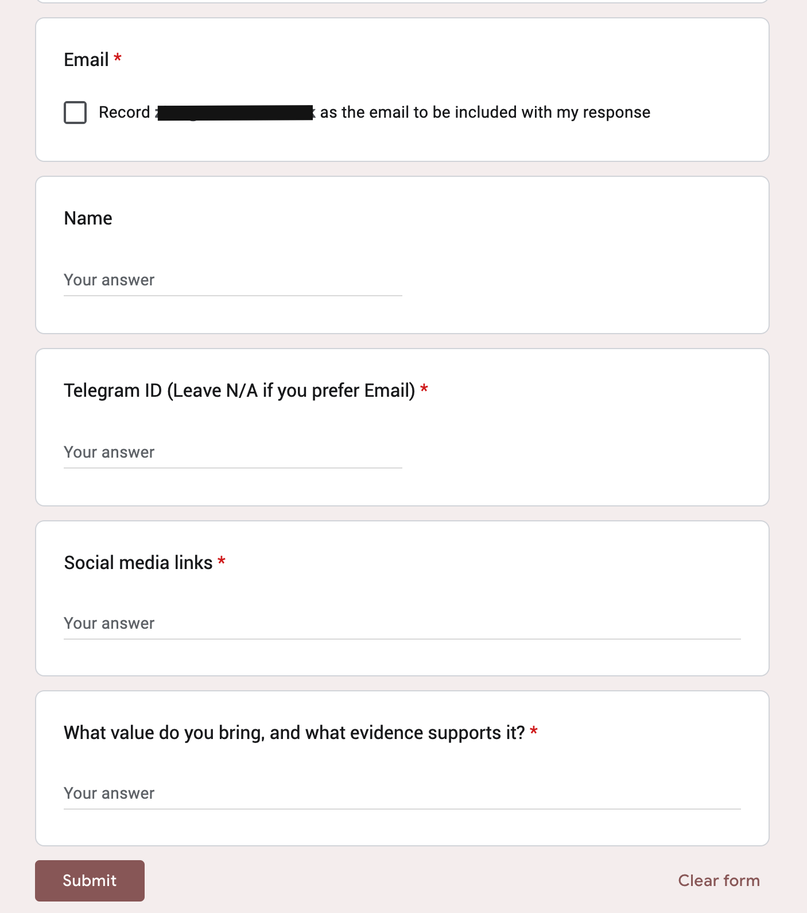
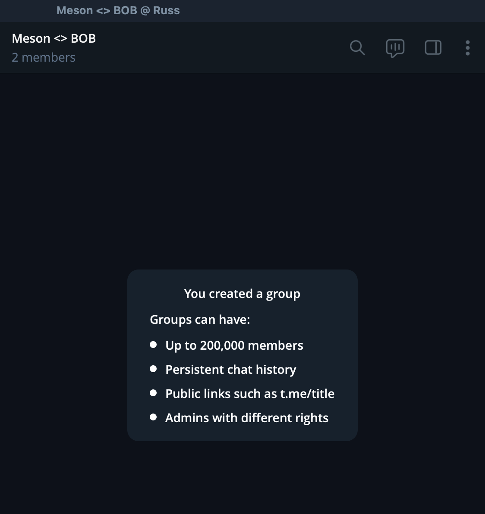
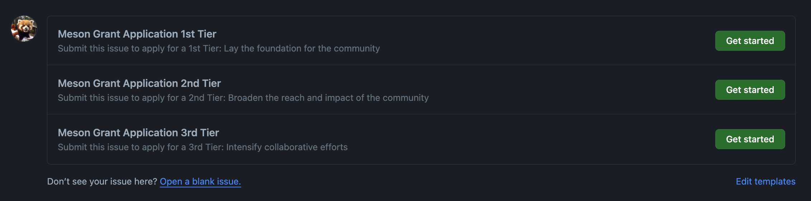
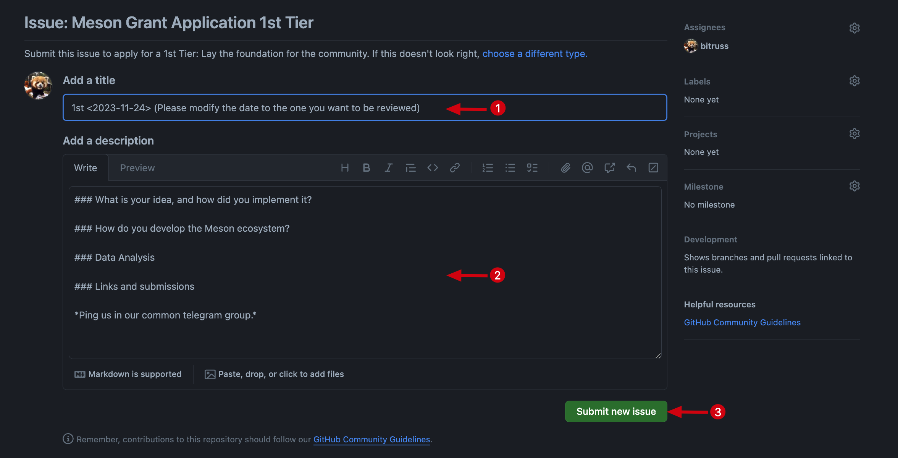

# Meson Grants

The Meson BUILDer Program II (*New Asgard*) application process is structured in three essential steps:

- **Application:** Begin the process by completing the application [Forms](https://t.co/ZGh5KXofiq), a quick step that should take just 2-3 minutes
- **Contribution:** It's your time to shine. This is where you get to demonstrate your unique talents and skills
- **Submission:** The final step entails submitting the achieved results through the [GitHub](https://github.com/daqnext/meson-grants/issues/new/choose)

Each step is integral to the overall application journey.

## Application

Apply on Meson Website -> `Builder Application` or use the [forms](https://t.co/ZGh5KXofiq).

You will receive an invitation to our Telegram group from **`@bitruss`** within 24 hours.

If you don't provide a Telegram handle, an invitation will be sent to you via email from `@meson.network`.

e.g.

## Contribution
In this sector, you have the opportunity to leverage your talents for the benefit of the community. For instance, you could author articles or posts on platforms like Twitter or various forums, explaining Meson's significance and functions. Alternatively, you might opt to produce engaging vlogs about Meson as a YouTuber. Additionally, you can establish and manage Telegram or Discord groups to spread further awareness about Meson.

Overall, we offer considerable flexibility in how you contribute, and your unique contributions are highly valued.

## Submission
Meson Grants are divided into three stages, and progression is tiered, meaning completion of the 1st tier is a prerequisite for applying for the 2nd tier, and so forth.

## FAQ
#### Can I directly apply for 2nd/3rd tier?
Begin with the 1st Tier; once your contributions have been acknowledged and rewarded for this level, you may then proceed to submit for the 2nd Tier, then 3rd Tier.

#### Is it possible to apply for the same tier multiple times?
You are welcome to apply at your convenience. However, please note that the 1st Tier offers a one-time reward for your community contributions, whereas the 2nd Tier provides ongoing rewards, contingent on meeting the set criteria.

#### Where can I find the description for stages

[https://github.com/daqnext/meson-grants](https://github.com/daqnext/meson-grants)