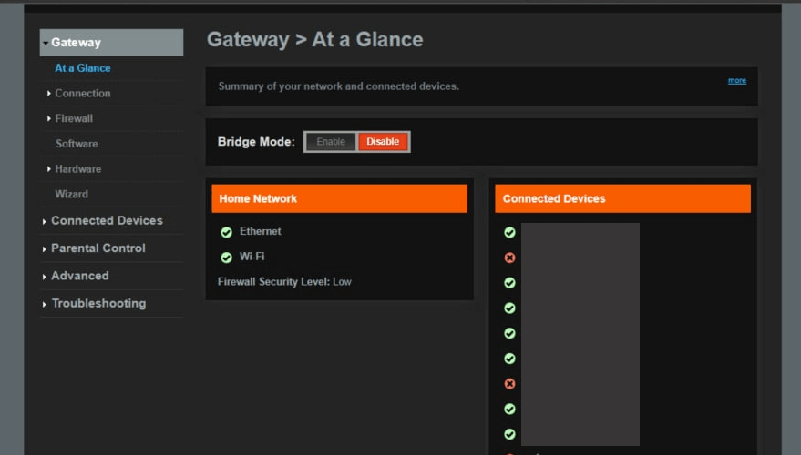

# Run Meson ARM Node 101

[[toc]]

## Deploy Requirements

- A Public(Static/Dynamic) IP or A DHCP Reservation
- An ARM-based Devices(Raspberry Pi/Soft Router/Jetson Nano etc.)
- Opening the port of the firewall (default: 443, support for custom server ports)
- Providing enough Storage (default minimum requirements: 20G)

## Supported Unix/Linux operating systems

|OS|Website|
|:-:|:-:|
|Ubuntu|[https://ubuntu.com/download/server/arm](https://ubuntu.com/download/server/arm)|
|Debian|[https://www.debian.org/ports/arm](https://www.debian.org/ports/arm/)|
|Raspberry Pi OS|[https://www.raspberrypi.com/software](https://www.raspberrypi.com/software/)|
|Fedora|[https://arm.fedoraproject.org](https://arm.fedoraproject.org/)|
|OpenWrt|[https://openwrt.org](https://openwrt.org)|
|Armbian|[https://www.armbian.com](https://www.armbian.com)|
|DietPi|[https://dietpi.com](https://dietpi.com/)|
|Manjaro|[https://manjaro.org/download/#ARM](https://manjaro.org/download/#ARM)|
|Arch Linux|[https://archlinuxarm.org](https://archlinuxarm.org/about/downloads)|
|openSUSE|[https://get.opensuse.org](https://get.opensuse.org)|
|Asahi Linux|[https://asahilinux.org](https://asahilinux.org)|

## Register

[https://dashboard.meson.network/register](https://dashboard.meson.network/register)


Click the button “Nodes” and you can find out your token and installation tutorial in this page


## How to Install Meson on ARM (Linux)?

### 1.Download & Install

<CodeGroup>

  <CodeGroupItem title="Linux ARM 64-bit">

```bash
wget 'https://staticassets.meson.network/public/meson_cdn/v3.1.18/meson_cdn-linux-arm64.tar.gz' && tar -zxf meson_cdn-linux-arm64.tar.gz && rm -f meson_cdn-linux-arm64.tar.gz && cd ./meson_cdn-linux-arm64 && sudo ./service install meson_cdn
```

  </CodeGroupItem>

  <CodeGroupItem title="Linux ARM 32-bit">

```bash
wget 'https://github.com/daqnext/meson-terminal/releases/download/v3.1.18/meson_cdn-linux-arm.tar.gz' && tar -zxf meson_cdn-linux-arm.tar.gz && rm -f meson_cdn-linux-arm.tar.gz && cd ./meson_cdn-linux-arm && sudo ./service install meson_cdn
```

  </CodeGroupItem>

</CodeGroup>

Check the output of `uname -m`. If the result is `aarch32` you are running the ARM Linux kernel in `32-bit` and if the result is `aarch64` or `arm64` you are running the kernel in `64-bit` mode. check out [List of ARM processors](https://en.wikipedia.org/wiki/List_of_ARM_processors).

### 2.Set token and config

```bash
sudo ./meson_cdn config set --token=your token --https_port=443 --cache.size=30
```

When your ISP does not provide Static IP, you can need to set other ports other than `443`.Valid values range from `1` through `65535`.

In the example, I changed the default port to `1943`.

```bash
sudo ./meson_cdn config set --token=your token --https_port=1943 --cache.size=30
```

Param List:

```bash
-token=your token              # you can find out your token in nodes page
-https_port=443                # default is 443, support for custom server ports
-cache.size=30                 # minimum: 20G, default: 30G
-cache.folder=xxxx             # string, cache folder path, could be an absolute path
```

### 3.Start Service

```bash
sudo ./service start meson_cdn
```

## How to Forward Ports on Your Router?

Learn to set up port forwarding, check out [https://portforward.com](https://portforward.com/router.htm?utm_source=mesonnetwork) or your Router's instructions.

Take Cisco DPC3941T XFINITY router for example, the basic process to port forwarding is:

### 1.Login to your Cisco DPC3941T XFINITY router.

- The default IP Address is: `10.0.0.1`
- The default Username is: `admin`
- The default Password is: `password`

### 2.Navigate to the port forwarding section.

Now we need to find the **port forwarding** section in your router. Here's how you do it. Starting from the first page in your router:



Click the **Advanced** link near the left of the page.

You should now see a new menu. In this new menu, click **Port Forwarding**.


Click the **Add Service** button near the center of the page.


### 3.Create a port forward entry.

Select **Other** from the **Common Service** dropdown box.

Put a name for this forward in the **Service Name** box so that you can remember why you set this forward up.

Use the **Service Type** dropdown box to select the protocol type of the ports you are forwarding.

Enter the IP address that you are forwarding ports to in the **Server IP Address** box.

If you are forwarding a single port, enter that port number into the **Start Port** and the **End Port** boxes. 

In the example, I changed the default port to `1943`.
- TCP Ports: `1943`
- UDP Ports: `1943`

When you are done click the **Save** button.

Your ports should now be open. test if your ports are open.

After 2-3 minutes, you will have a new terminal record at **terminals open in new node** .

