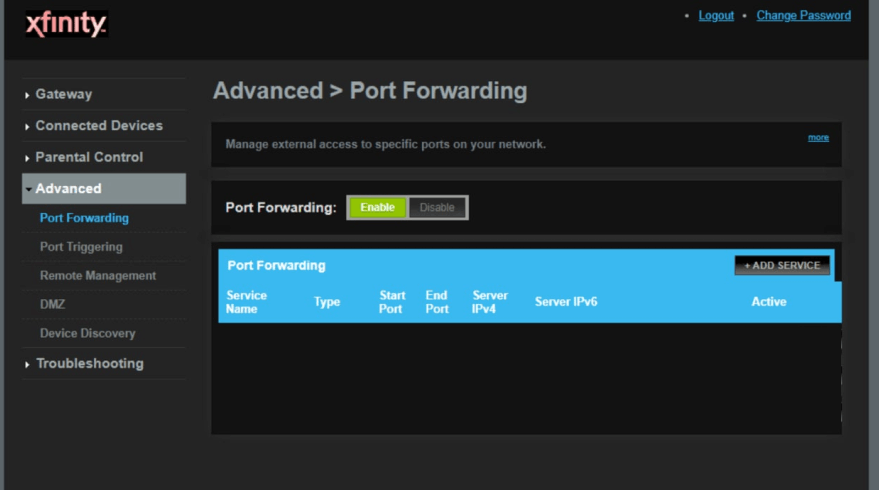
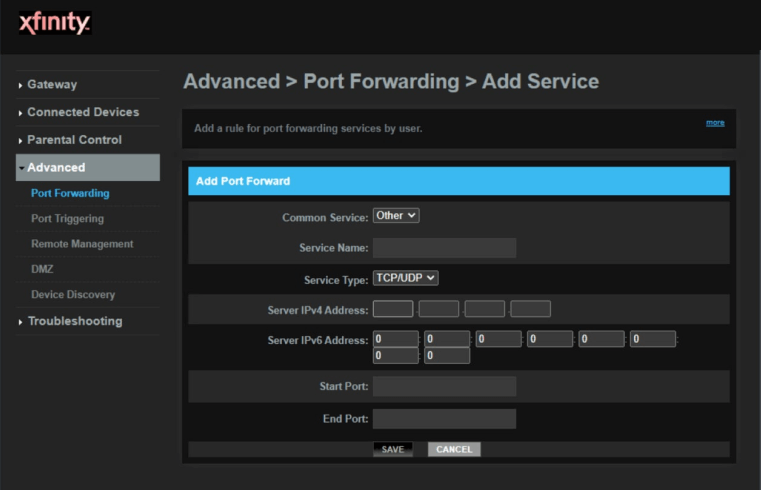

# Запуск Meson ARM Node 101

[[toc]]

## Deploy Requirements

- Публичный (статический/динамический) IP или резервирование DHCP
- Устройства на базе ARM (Raspberry Pi/Soft Router/Jetson Nano и т.д.)
- Открытие порта брандмауэра (по умолчанию: 443, поддержка пользовательских портов сервера)
- Обеспечение достаточного объема памяти (минимальные требования по умолчанию: 20 Гб)

## ​Поддерживаемые операционные системы Unix/Linux

|OS|Website|
|:-:|:-:|
|Ubuntu|[https://ubuntu.com/download/server/arm](https://ubuntu.com/download/server/arm)|
|Debian|[https://www.debian.org/ports/arm](https://www.debian.org/ports/arm/)|
|Raspberry Pi OS|[https://www.raspberrypi.com/software](https://www.raspberrypi.com/software/)|
|Fedora|[https://arm.fedoraproject.org](https://arm.fedoraproject.org/)|
|OpenWrt|[https://openwrt.org](https://openwrt.org)|
|Armbian|[https://www.armbian.com](https://www.armbian.com)|
|DietPi|[https://dietpi.com](https://dietpi.com/)|
|Manjaro|[https://manjaro.org/download/#ARM](https://manjaro.org/download/#ARM)|
|Arch Linux|[https://archlinuxarm.org](https://archlinuxarm.org/about/downloads)|
|openSUSE|[https://get.opensuse.org](https://get.opensuse.org)|
|Asahi Linux|[https://asahilinux.org](https://asahilinux.org)|

## Регистрация

[https://dashboard.meson.network/register](https://dashboard.meson.network/register)


Нажмите кнопку "Nodes", и на этой странице вы сможете найти свой токен и руководство по установке


## Как установить Meson на ARM (Linux)?

### 1.Загрузка и установка

<CodeGroup>

  <CodeGroupItem title="Linux ARM 64-bit">

```bash
wget 'https://staticassets.meson.network/public/meson_cdn/v3.1.18/meson_cdn-linux-arm64.tar.gz' && tar -zxf meson_cdn-linux-arm64.tar.gz && rm -f meson_cdn-linux-arm64.tar.gz && cd ./meson_cdn-linux-arm64 && sudo ./service install meson_cdn
```

  </CodeGroupItem>

  <CodeGroupItem title="Linux ARM 32-bit">

```bash
wget 'https://github.com/daqnext/meson-terminal/releases/download/v3.1.18/meson_cdn-linux-arm.tar.gz' && tar -zxf meson_cdn-linux-arm.tar.gz && rm -f meson_cdn-linux-arm.tar.gz && cd ./meson_cdn-linux-arm && sudo ./service install meson_cdn
```

  </CodeGroupItem>

</CodeGroup>

Проверьте вывод `uname -m`. Если результат - `aarch32`, вы запускаете ядро ARM Linux в `32-битном` режиме, а если результат - `aarch64` или `arm64`, вы запускаете ядро в `64-битном` режиме. проверить [Список архитектур ARM](https://ru.wikipedia.org/wiki/%D0%A1%D0%BF%D0%B8%D1%81%D0%BE%D0%BA_%D0%B0%D1%80%D1%85%D0%B8%D1%82%D0%B5%D0%BA%D1%82%D1%83%D1%80_ARM).

### 2.Установка токена и конфигурации

```bash
sudo ./meson_cdn config set --token=your token --https_port=443 --cache.size=30
```

Если ваш провайдер не предоставляет статический IP, вам может понадобиться установить другие порты, кроме `443`. Допустимые значения варьируются от `1` до `65535`.

В примере я изменил порт по умолчанию на `1943`.

```bash
sudo ./meson_cdn config set --token=your token --https_port=1943 --cache.size=30
```

Список параметров:

```bash
-token=your token              # you can find out your token in nodes page
-https_port=443                # default is 443, support for custom server ports
-cache.size=30                 # minimum: 20G, default: 30G
-cache.folder=xxxx             # string, cache folder path, could be an absolute path
```

### 3.Запуск сервиса

```bash
sudo ./service start meson_cdn
```

## Как переадресовывать порты на маршрутизаторе?

Чтобы узнать, как настроить проброс портов, ознакомьтесь с инструкциями на сайте [https://portforward.com](https://portforward.com/router.htm?utm_source=mesonnetwork) или на вашем маршрутизаторе.

Для примера возьмем маршрутизатор Cisco DPC3941T XFINITY, основной процесс переадресации портов заключается в следующем:

### 1.Войдите в маршрутизатор Cisco DPC3941T XFINITY.

- IP-адрес по умолчанию: `10.0.0.1`
- Имя пользователя по умолчанию: `admin`
- Пароль по умолчанию: `password`

### 2.Перейдите в раздел "Переадресация портов".

Теперь нам нужно найти раздел переадресации портов в вашем маршрутизаторе. Вот как это делается. Начните с первой страницы в вашем маршрутизаторе:


Щелкните ссылку **Дополнительно (Advanced)** в левой части страницы.

Теперь у вас должно появиться новое меню. В этом новом меню нажмите **Port Forwarding**.



Нажмите кнопку **Add Service** в центре страницы.



### 3.Создайте запись о переадресации порта.

Выберите **Other** из **Common Service** выпадающее окно.

Дайте имя этому форварду в **Service Name** чтобы вы могли вспомнить, зачем вы установили этот форвард.

Используйте **Service Type** выпадающее поле для выбора типа протокола перенаправляемых портов.

Введите IP-адрес, на который вы перенаправляете порты, в поле **Server IP Address**.

Если вы перенаправляете один порт, введите номер этого порта в поля **Start Port** и **End Port**.

В примере я изменил порт по умолчанию на `1943`.

- TCP Ports: `1943`
- UDP Ports: `1943`

Когда вы закончите, нажмите кнопку **Save**. 

Теперь ваши порты должны быть открыты. Проверьте, открыты ли ваши порты.

Через 2-3 минуты у вас появится запись о новом терминале.

