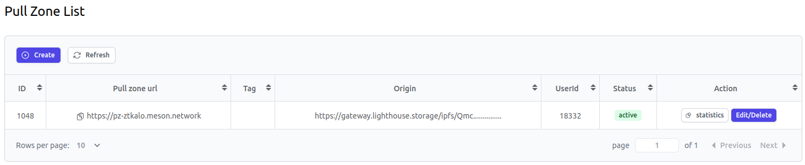

# Месон усиливает Лайтхаус Сторидж

## **Использование Лайтхаус с Месон: подробное руководство**

### **Введение**

В эпоху цифровых данных первостепенное значение имеет надежное и постоянное решение для хранения файлов. **Лайтхаус** является лидером в этой области, предлагая модель хранения, предназначенную для долгосрочного хранения. Он использует сеть майнеров и емкость хранилища сети filecoin, а также систему адресации контента IPFS. Использование Лайтхаус IPFS обеспечивает защищенное от несанкционированного доступа и цензуры хранение файлов с постоянным хранилищем майнеров Filecoin, эффективно обеспечивая надежность данных и упрощая нюансы устойчивого, долгосрочного и постоянного хранения.


Однако каждая технология может выиграть от повышения производительности. Введите **Месон**, слой кэша, который увеличивает скорость доставки вашего контента из Лайтхаус. В этом руководстве мы покажем вам, как интегрировать Месон с Лайтхаус для оптимизации доставки вашего контента.

### **1. Понимание Маяк**

Прежде чем углубиться в шаги, давайте получим четкое представление о Маяке:

- **Устойчивое хранение**: модель хранения Лайтхаус с прицелом на будущее делает упор на долговечность и отказоустойчивость.
- **Зашифрованные данные**: разработчики получают выгоду от хранения зашифрованных данных в Лайтхаус, открывая путь для создания приложений с токен-гейтом.
- **Ориентирован на разработчиков**: Лайтхаус не только ценит безопасность данных, но и обеспечивает простоту интеграции, предлагая различные SDK на разных языках и специальный интерфейс командной строки.

### **2. Настройка Лайтхаус**

- Сайт - https://lighthouse.storage

- Войдите в [Files Dapp](https://files.lighthouse.storage/) с помощью своего кошелька или учетной записи github, чтобы начать загрузку файлов в Lighthouse.

- Необязательно:

    * Получите [Lighthouse CLI] (https://lighthouse-1.gitbook.io/lighthouse-1/cli-tool/overview)
    * Получите [Lighthouse Javascript SDK] (https://lighthouse-1.gitbook.io/lighthouse-1/lighthouse-sdk/overview)
    * Получите [Python SDK] (https://pypi.org/project/lighthouseweb3/)

**В этом руководстве мы будем использовать метод командной строки для загрузки файла с помощью Лайтхаус.**

Отправляясь в приключение Лайтхаус:

1. **Установите Лайтхаус SDK и создайте кошелек**:
    - Чтобы интегрировать Лайтхаус в ваш рабочий процесс, начните с глобальной установки SDK:
        
        ```bash
        npm install -g @lighthouse-web3/sdk
        ```

    - После этого создайте новый кошелек Лайтхаус. После выполнения вас поприветствуют как **`Открытый ключ`**, так и **`Закрытый ключ`**. Крайне важно, чтобы вы надежно хранили эти учетные данные:
        
        ```bash
        lighthouse-web3 create-wallet
        ```

2. **Загрузка файлов с помощью интерфейса командной строки Лайтхаус**:
     - После установки SDK и настройки кошелька все готово для загрузки файлов непосредственно из командной строки. Выполните следующее:
        
        ```bash
        lighthouse-web3 upload /path/to/your/file
        ```

    - Замените `/path/to/your/file` на фактический путь к вашему файлу. После успешной загрузки интерфейс командной строки вернет уникальный идентификатор файла Лайтхаус, отмечая присутствие вашего файла в сети.
**Ожидаемый результат:**
```bash
Visit: https://gateway.lighthouse.storage/ipfs/Qmc........
       https://ipfs.io/ipfs/Qmc........
CID: Qmc........
```

### **3. Интегрирующий мезон**

Ускорение доставки вашего контента из Лайтхаус может быть достигнуто с помощью Месон. Давайте проведем вас через шаги по интеграции Месон СДН вит Лайтхаус:

1. **Зарегистрируйтесь на Месон СДН**:
- Перейдите к [панели управления Месон](https://dashboard.meson.network/register).
    - Зарегистрируйте учетную запись, если вы еще этого не сделали, или войдите в систему.
        

2. **Укажите исходный URL**:
    - После входа в систему вам будет предложено указать «Origin URL». Это должно отражать ваш основной URL-адрес от шлюза хранилища Лайтхаус, например, `https://gateway.lighthouse.storage/ipfs/Qmc........`.
   
     

3. **Создайте зону вытягивания**:
    - После указания Origin URL источника нажмите `Add`. После этого вы получите `Pull zone url`.
   
     

4. **Переход URL**:
    - Измените собственный путь Лайтхаус, чтобы он соответствовал его аналогу, усиленному Meson:

    ```bash
    https://gateway.lighthouse.storage/ipfs/Qmc........     
    =>
     https://pz-z......meson.network
    ```

Когда переход завершен, теперь вы можете использовать расширенный URL-адрес Месон для более быстрой доставки контента через CDN. Это гарантирует, что ваш контент не только надежно хранится, но и доставляется пользователям с оптимальной скоростью.

### **4. Синергия Мезон-Лайтхаус**
**Быстрое извлечение:** мастерство кэширования Месон повышает скорость доступа к файлам Лайтхаус, особенно для популярного контента.
**Экономическое преимущество.** Уменьшение частоты прямого доступа к хранилищу Лайтхаус приводит к экономии средств.
**Масштабируемое совершенство:** Месон изящно справляется с пиками трафика, обеспечивая стабильное взаимодействие с пользователем.


### Дополнительные ресурсы
Изучите исчерпывающую [документацию] Лайтхаус (https://www.lighthouse.storage/documentation).
Оставайтесь в курсе с [X обновлений](https://twitter.com/LighthouseWeb3).
Погрузитесь в обсуждения на [Discord](https://discord.com/invite/c4a4CGCdJG).
Заполните эту [Форму](https://airtable.com/shrPFC2TgojuOAYO4), чтобы подать заявку на бесплатное хранилище и выделенный шлюз.