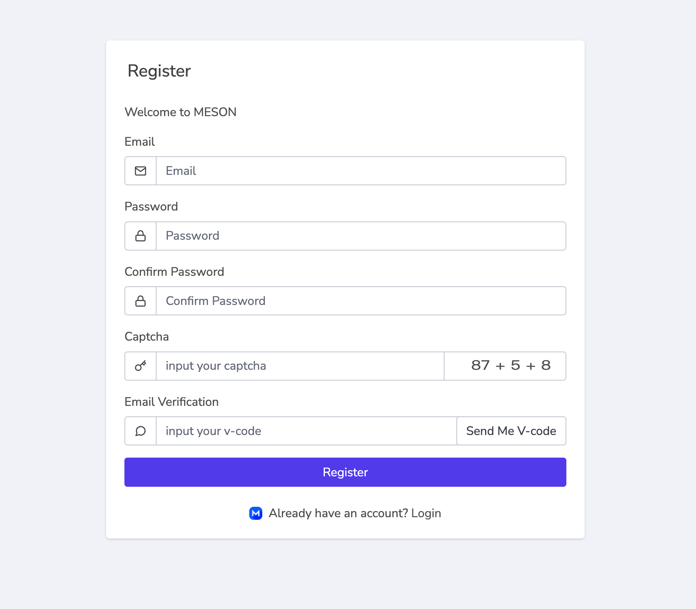
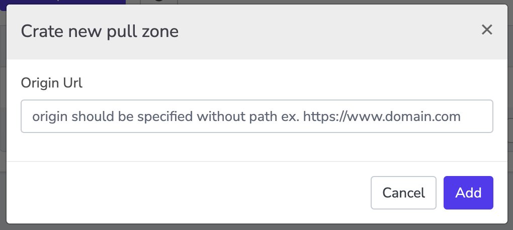

# Работа с вэб-сайтами

Anything to accelerate by Meson Network can be as simple as changing the URL.

## Register Meson CDN

Register and Login to Meson CDN dashboard

[https://dashboard.meson.network/register](https://dashboard.meson.network/register)



## Create Pull Zone

Click `Pull zones`, check out the `Pull Zone List`.


Click `Create pull zone`, and Enter the Website Domain you want to accelerate.



“Origin Url” should be specified without path. for example, [https://www.domain.com](https://www.domain.com/)

## Пример: Meson улучшает IPFS

Мы добавили кэш-слой (он же второй слой) на IPFS, который хранит файлы высокочастотного поиска в Meson. Это может быть полезно для оптимизации скорости доставки контента и экономии затрат/напряжения на основном уровне хранения (IPFS).

Определите URL-адрес происхождения (например, https://ipfs.io).


Нажмите `Add`, Получить `Pull zone url`


Измените исходный путь на новый.

```bash
https://ipfs.io/ipfs/QmXoypizjW3WknFiJnKLwHCnL72vedxjQkDDP1mXWo6uco/wiki/
=>
https://pz-rlhgrj.meson.network/ipfs/QmXoypizjW3WknFiJnKLwHCnL72vedxjQkDDP1mXWo6uco/wiki/
```

Теперь запросите этот новый url. meson нужно некоторое время, чтобы развернуть файл на распределенных терминалах по всему миру.

```bash
https://spec00-bfhkcefkbefkfxx-06-rlhgrj.mesontracking.com/ipfs/QmXoypizjW3WknFiJnKLwHCnL72vedxjQkDDP1mXWo6uco/wiki/_m_access_key_caavymwyao
```

Ссылка переходит на определенный узел для обслуживания запроса, `spec00-bfhkcefkbefkfxx-06-rlhgrj` - хэш узла.

