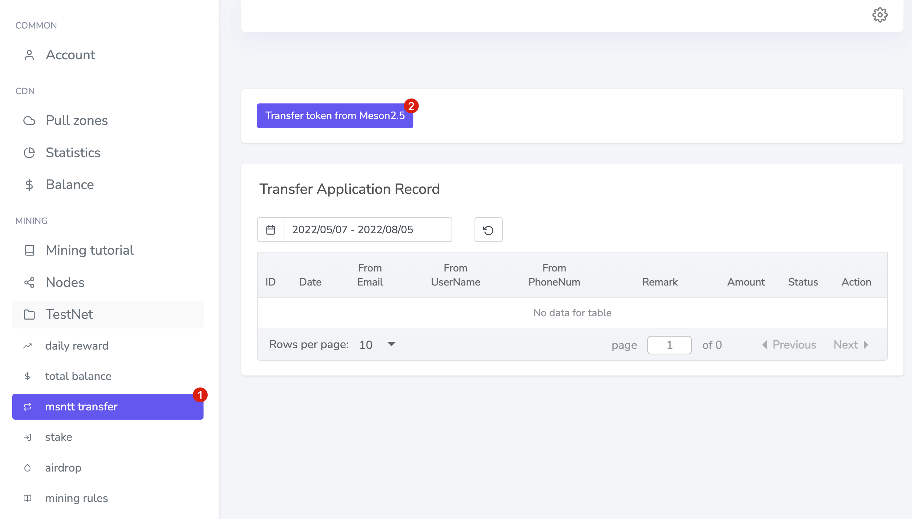
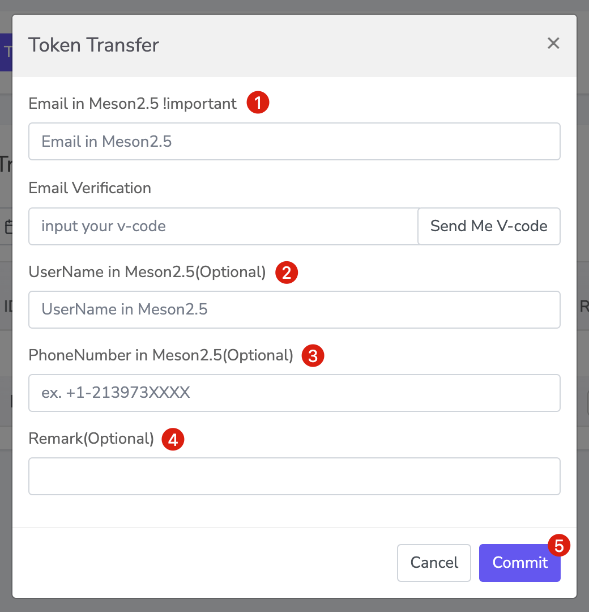
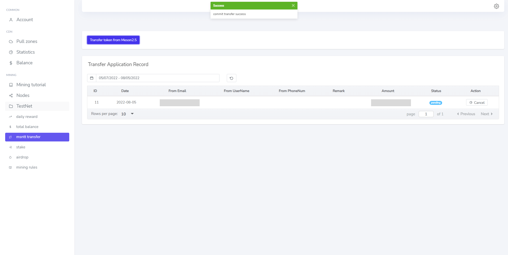
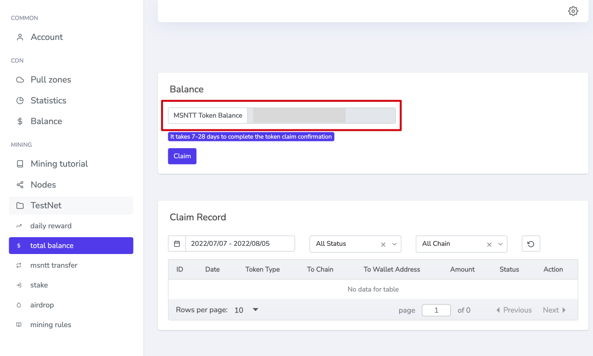

# MSNTT Transfer 101

MSNTT Transferi 101, Meson TestNet Token'i (MSNTT) Meson 2.5'den Meson 3.0'a aktarmaya yönelik tanıtımdır.

## MSNTT transfer sayfasına gidin

[https://dashboard.meson.network/old_msntt_transfer](https://dashboard.meson.network/old_msntt_transfer)

`msntt transfer`'e tıklayın ve `Transfer Application Record`'a göz atın.
`Transfer token from Meson2.5`'e tıklayın ve `Token Transfer` işlemlerini gerçekleştirin.

## Token Transferini Bildirmek

Meson2.5'in Email'ini gerekli olarak, UserName'i (kullanıcı adı) ve PhoneNumber 'ı (telefon numarası) ise isteğe bağlı sağlamanız gereklidir. Ne kadar eksiksiz olursa incelemeyi o kadar hızlı geçer.

🔎 Bir sorunuz mu var? [Meson Discord Sunucusu](https://discord.com/invite/z6YfSHDkmS) 'nun `💻deploy-mining-questions` kanalında core geliştiricilerle doğrudan iletişim kurabilirsiniz.

::: tip
- **User does not exist in Meson 2.5**: E-posta hatası
- **This Email has already been transferred**: Başvuru başarıyla tamamlandı fakat henüz incelemeden geçmedi.
- **Commit transfer success**: Başarıyla gönderildi ve onay için bekleniyor.
:::

Başarılı bir başvurudan sonra, durum `pending` (beklemede) olarak gösterecektir. Lütfen `Amount` (miktar) kısmından MSNTT sayısını kontrol edin. İnceleme 24 saat içerisinde tamamlanacaktır.

İncelemeden sonra, Meson 2.5 test para biriminin Meson 3.0'a başarıyla aktarıldığını `MSNTT Token Balance` (Token Bakiyesi) kısmından görebilirsiniz.

