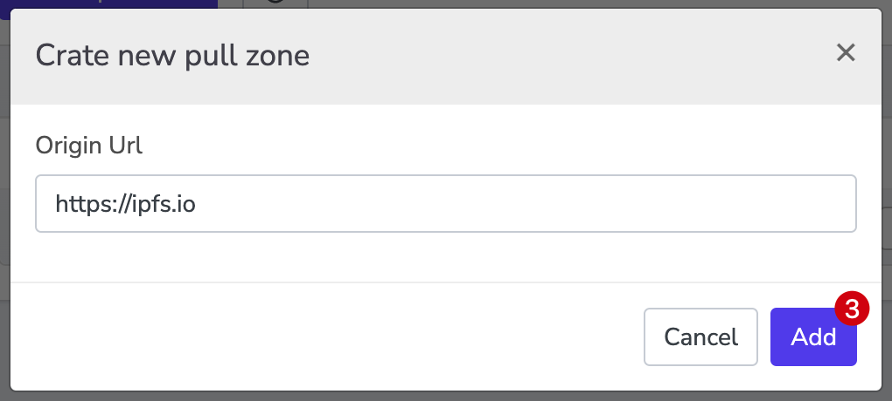

# Meson IPFS/Filecoin'i geliştirir

IPFS'e, sık sık çağırılan dosyaları Meson'a depolayan bir önbellek katmanı (diğer bir deyişle ikinci katman) ekledik. İçerik teslimi için hızı optimize etmek ve temel depolama katmanında (IPFS) maliyet/baskıdan tasarruf etmek faydalı olabilir.

Kaynak URL'yi tanımla (e.g. https://ipfs.io)



"`Add`" butonuna tıkla, "`Pull zone URL`"yi alın.


Orijinal sekmeyi yenisiyle değiştirin.

```bash
https://ipfs.io/ipfs/QmXoypizjW3WknFiJnKLwHCnL72vedxjQkDDP1mXWo6uco/wiki/
=>
https://pz-rlhgrj.meson.network/ipfs/QmXoypizjW3WknFiJnKLwHCnL72vedxjQkDDP1mXWo6uco/wiki/
```

Şimdi bu yeni url'yi isteyin. Meson'un dosyayı küresel olarak dağıtılmış terminallere dağıtması için biraz zamana ihtiyacı var.

```bash
https://spec00-bfhkcefkbefkfxx-06-rlhgrj.mesontracking.com/ipfs/QmXoypizjW3WknFiJnKLwHCnL72vedxjQkDDP1mXWo6uco/wiki/_m_access_key_caavymwyao
```

Bağlantı, isteği yerine getirmek için belirli bir node'a atlar,`spec00-bfhkcefkbefkfxx-06-rlhgrj` node'un kısaltılmış ve sabit değeridir.

