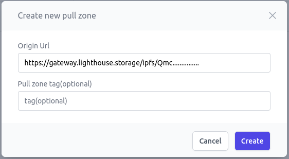

# Meson enhance Lighthouse Storage

## **Using Lighthouse with Meson: A Comprehensive Tutorial**

### **Introduction**

In an era defined by digital data, a reliable and persistent file storage solution is paramount. **Lighthouse** emerges as a front-runner in this domain, offering a storage model designed for long-term storage. It uses the miner network and storage capacity of the filecoin network and IPFS content-addressing system. Lighthouse's reliance on IPFS ensures tamper-proof and censorship-resistant file storage with persistent storage of Filecoin miners, effectively providing data reliability and simplifying the nuances of sustainable, long-term, and perpetual storage.

However, every technology can benefit from a performance enhancement. Enter **Meson**, a cache layer that adds an extra boost to your content delivery from Lighthouse. In this tutorial, we'll walk you through integrating Meson with Lighthouse to optimize your content delivery.


### **1. Understanding Lighthouse**

Before diving deep into the steps, let's get a clear picture of Lighthouse:

- **Sustainable Storage**: With an eye on the future, Lighthouse's storage model emphasizes longevity and resilience.
- **Encrypted Data**: Developers benefit from storing encrypted data on Lighthouse, paving the way to craft token-gated applications.
- **Developer-Centric**: Lighthouse not only values data security but also ensures ease of integration by offering a variety of SDKs in various languages and a dedicated CLI.

### **2. Setting Up Lighthouse**

- Website - https://lighthouse.storage

- Sign into [Files Dapp](https://files.lighthouse.storage/) with your wallet or your github account to start uploading files to Lighthouse

- Optionally:

    * Get [Lighthouse CLI](https://lighthouse-1.gitbook.io/lighthouse-1/cli-tool/overview)
    * Get [Lighthouse Javascript SDK](https://lighthouse-1.gitbook.io/lighthouse-1/lighthouse-sdk/overview)
    * Get [Python SDK](https://pypi.org/project/lighthouseweb3/)

**In this tutorial, we will be using the CLI method to upload a file using Lighthouse.**

Embarking on your Lighthouse adventure:

1. **Install Lighthouse SDK and Create Wallet**:
    - To integrate Lighthouse into your workflow, begin by installing the SDK globally:
        
        ```bash
        npm install -g @lighthouse-web3/sdk
        ```

    - Following this, create a new Lighthouse wallet. Upon execution, you'll be greeted with both a **`Public Key`** and a **`Private Key`**. It's paramount you store these credentials securely:
        
        ```bash
        lighthouse-web3 create-wallet
        ```

2. **Uploading Files Using Lighthouse CLI**:
    - With the SDK installed and wallet configured, you're all set to upload files directly from the command line. Execute the following:
        
        ```bash
        lighthouse-web3 upload /path/to/your/file
        ```

    - Replace `/path/to/your/file` with the actual path to your file. After successful upload, the CLI will return a unique Lighthouse file identifier, marking your file's presence on the network.
**Expected output:**
```bash
Visit: https://gateway.lighthouse.storage/ipfs/Qmc........
       https://ipfs.io/ipfs/Qmc........
CID: Qmc........
```

### **3. Integrating Meson**

Boosting your content delivery from Lighthouse can be achieved seamlessly with Meson. Let's guide you through the steps to integrate the Meson CDN with Lighthouse:

1. **Register on Meson CDN**:
   - Navigate to the [Meson Dashboard](https://dashboard.meson.network/register).
   - Register for an account if you haven't already or sign in.
        

2. **Specify the Origin URL**:
   - Once logged in, you will be prompted to provide an "Origin URL." This should reflect your primary URL from Lighthouse storage Gateway, e.g., `https://gateway.lighthouse.storage/ipfs/Qmc........`.
   
     

3. **Create a Pull Zone**:
   - After specifying the Origin URL, click on `Add`. Upon doing so, you'll receive a `Pull zone url`.
   
     

4. **URL Transition**:
   - Modify the native Lighthouse path to align with its Meson-boosted counterpart:

    ```bash
    https://gateway.lighthouse.storage/ipfs/Qmc........     
    =>
     https://pz-z......meson.network
    ```

With the transition complete, you can now use the Meson-enhanced URL for faster content delivery via CDN. This ensures that your content is not only stored securely but also delivered to users with optimal speed.

### **4. The Meson-Lighthouse Synergy**
**Rapid Retrievals:** Meson's caching prowess enhances Lighthouse's file access speeds, especially for popular content.
**Economic Advantage:** Diminishing the frequency of direct Lighthouse storage access translates to cost savings.
**Scalable Excellence:** Meson gracefully handles traffic surges, ensuring consistent user experiences.


### Further Resources
Explore Lighthouse's comprehensive [Documentation](https://www.lighthouse.storage/documentation).
Stay in the loop with [X updates](https://twitter.com/LighthouseWeb3).
Dive into discussions on [Discord](https://discord.com/invite/c4a4CGCdJG).
Fill up this [Form](https://airtable.com/shrPFC2TgojuOAYO4) to apply for free storage and dedicated gateway.