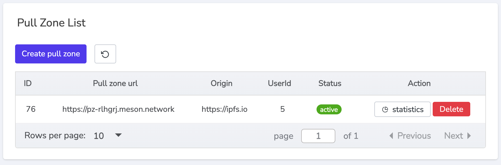

# Meson enhance IPFS/Filecoin

Upload a file to IPFS/Filecoin and get dataTxId.

We added a cache layer (AKA. second layer) on IPFS, which stores the high-frequency retrieval files to Meson. It might be helpful to optimize the speed for content delivery and to save the cost/pressure in the basic storage layer (IPFS).

Define the **Origin URL**(e.g. https://ipfs.io)


Click `Add`, Get `Pull zone url`



Change the original path into the new one.

```bash
https://ipfs.io/ipfs/QmXoypizjW3WknFiJnKLwHCnL72vedxjQkDDP1mXWo6uco/wiki/
=>
https://pz-rlhgrj.meson.network/ipfs/QmXoypizjW3WknFiJnKLwHCnL72vedxjQkDDP1mXWo6uco/wiki/
```

Now request this new url. meson needs some time to deploy the file on distributed terminals globally.

```bash
https://spec00-bfhkcefkbefkfxx-06-rlhgrj.mesontracking.com/ipfs/QmXoypizjW3WknFiJnKLwHCnL72vedxjQkDDP1mXWo6uco/wiki/_m_access_key_caavymwyao
```

The link jumps to a specific node to serve the request, `spec00-bfhkcefkbefkfxx-06-rlhgrj` is the hash of node.

